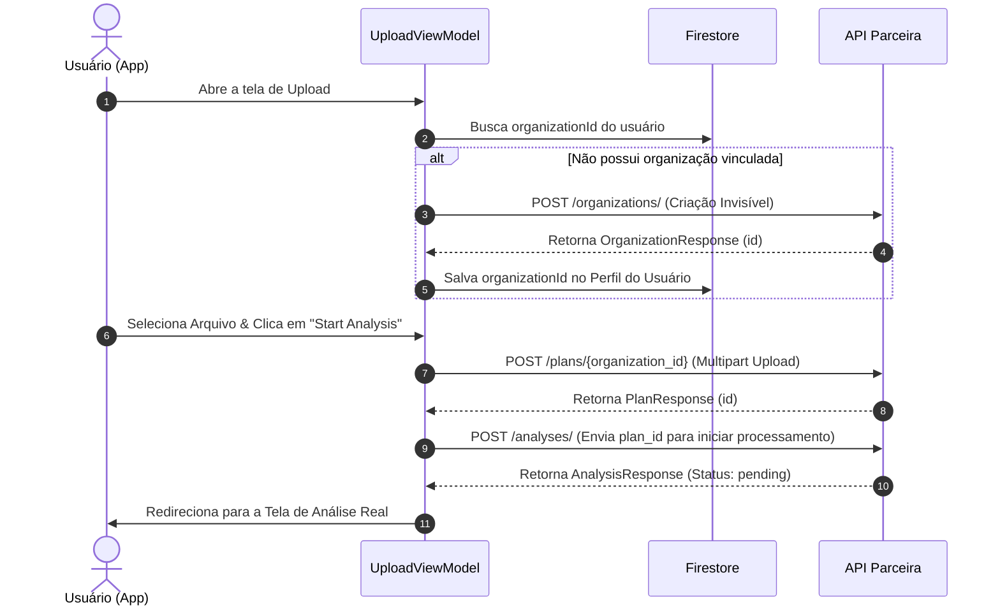

# Walkthrough: Relatório de Funcionamento da API Integrada

Este documento detalha o estado atual da integração do aplicativo EcoBuild-AI com a API do parceiro, descrevendo as rotas utilizadas, os fluxos automatizados e como os dados são gerenciados.

## 🔗 Detalhes da Conexão
- **Endpoint Base**: `http://172.30.69.4:8000/`
- **Configuração de Rede**: Gerenciada via `NetworkModule` utilizando **Retrofit** para mapeamento de rotas e **OkHttpClient** com interceptor de logs (`HttpLoggingInterceptor.Level.BODY`) para monitoramento de tráfego em tempo real.
- **Segurança local**: Ativado `usesCleartextTraffic="true"` no `AndroidManifest.xml` para permitir chamadas HTTP locais sem a obrigatoriedade de certificados HTTPS nesta fase de desenvolvimento.

---

## ⚡ Fluxos Automatizados e Mapeamento de Rotas

### 1. Gestão de Organizações (Invisível ao Usuário)
A API exige estritamente que cada planta pertença a uma organização. Para não impactar a experiência limpa do usuário, criamos uma automação:
*   **Rota Utilizada**: `POST /organizations/`
*   **Funcionamento**: Ao carregar o `UploadViewModel`, o app checa no Firestore se o usuário já tem um `organizationId`. Se estiver vazio, o app envia uma requisição criando a organização automaticamente (ex: *"Eduardo's Projects"*). O ID retornado é salvo no Firestore na ficha do usuário (`User.kt`).

### 2. Upload de Plantas de Construção
*   **Rota Utilizada**: `POST /plans/{organization_id}`
*   **Funcionamento**: Na tela de **Upload**, quando o usuário seleciona um PDF ou Imagem e clica em **"Start Analysis"**, o app lê o arquivo do armazenamento local, converte-o para um corpo binário do tipo `MultipartBody.Part` e faz o envio direto para o servidor utilizando o ID da organização do usuário. A API responde com o ID único da planta (`plan_id`).

### 3. Disparo da Análise de Sustentabilidade
*   **Rota Utilizada**: `POST /analyses/`
*   **Funcionamento**: Imediatamente após receber a confirmação de que a planta foi enviada com sucesso, o aplicativo faz uma chamada de acompanhamento enviando o `plan_id` recém-gerado. A API recebe a solicitação e inicia o motor de Inteligência Artificial em segundo plano, retornando o status inicial como `"pending"` ou `"processing"`.

---

## 🛠️ Próximas Implementações Recomendadas
- **Pooling/Consumo de Status na Tela de Análise**: Ativar o `AnalysisViewModel` criado para fazer requisições periódicas (`GET /analyses/{plan_id}`) a cada 3 segundos a fim de atualizar a interface assim que a API mudar o status para `"ready"`.
- **Renderização da Tabela de Materiais**: Mapear os resultados de `material_list` retornados pela API na UI para substituir por completo os mocks estáticos atuais.
