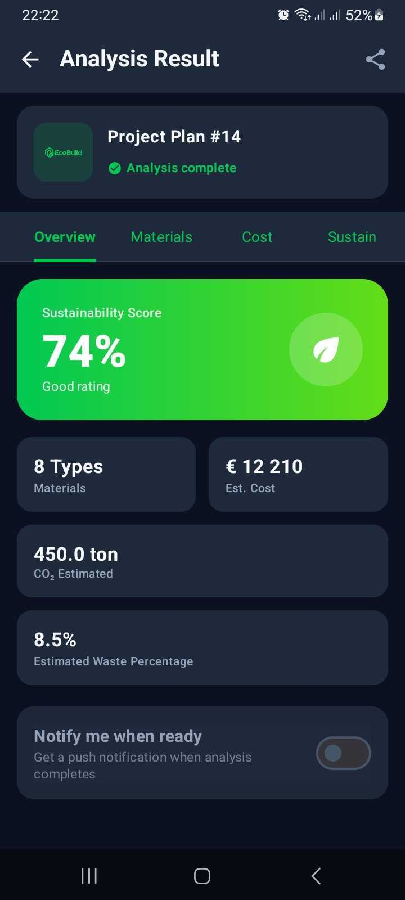

# 🌿 EcoBuild-AI

EcoBuild-AI is an Android application designed to promote sustainable construction by analyzing building plans using Artificial Intelligence. The app identifies materials, calculates carbon footprints, and provides a sustainability score to help architects and builders make greener choices.

---

## 🚀 Key Features

### 🔐 Authentication & Identity
*   **Secure Access**: Integration with Firebase Auth for Email/Password and Google Sign-In.
*   **Simplified Identity**: User management based on Full Name and Email (removing legacy username logic).
*   **Profile Management**: Editable user profiles with Firestore synchronization.

### 🏠 Intelligent Dashboard
*   **Personalized Greeting**: Dynamic UI that welcomes the user and shows recent activity.
*   **Recent Analyses**: History of the last 3 plans with quick access to full reports.
*   **Responsive Design**: Material Design 3 implementation with support for Light and Dark themes.

### 📤 Automated Upload Flow
*   **File Support**: Support for Image (PNG, JPG) and PDF uploads.
*   **PDF Previews**: Real-time thumbnail generation for the first page of PDF plans.
*   **Smart Organization**: Invisible creation and retrieval of API "Organizations," ensuring every plan is correctly filed without user friction.

### 📊 Sustainability Analysis (Real-time API)
*   **Real-time Connection**: Powered by Retrofit/OkHttp talking to a cloud-hosted API.
*   **Live Polling**: The app monitors the server's AI progress and updates automatically when results are ready.
*   **Sustainability Score**: Visual report featuring a vibrant green scorecard with a calculated eco-rating (e.g., 87% - Excellent Rating).
*   **Material Breakdown**: Detailed list of identified materials with their quantities and units.
*   **Eco Notifications**: Opt-in toggle to receive alerts when the AI completes a heavy analysis.

---

## 🛠️ Technical Stack

*   **Language**: Kotlin
*   **UI Framework**: Jetpack Compose (Modern, declarative UI)
*   **Networking**: Retrofit 2 + OkHttp 4 (with Logging Interceptor)
*   **Serialization**: Kotlinx Serialization
*   **Backend Services**: 
    *   Firebase Authentication
    *   Cloud Firestore (User data & organization mapping)
*   **Architecture**: MVVM (Model-View-ViewModel) for clean state management.

---

## 🔗 API Integration Details

The app connects to the **EcoBuild-AI Partner API** (hosted on Render):
*   **Base URL**: `https://ecobuild-ai.onrender.com/`
*   **Endpoints used**:
    *   `POST /organizations/`: For automated user onboarding.
    *   `POST /plans/`: For multipart binary file uploads.
    *   `POST /analyses/`: To trigger the AI engine.
    *   `GET /analyses/{id}`: To retrieve the final materials and score report.

---

## 📸 Design Philosophy
The UI follows a clean, "Eco-friendly" aesthetic using **EcoGreen** accents, rounded surfaces (24dp corners), and high-contrast cards to ensure clarity in construction sites or office environments.

---

© 2026 EcoBuild-AI Project.
